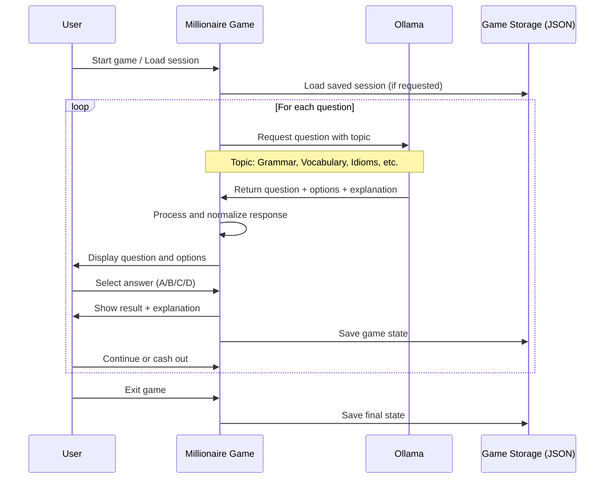

# repo
https://github.com/pleabargain/who-wants-to-learn-English-with-ollama-and-python

# Who Wants to be a Millionaire - English Learning Game

A terminal-based game inspired by "Who Wants to be a Millionaire" that helps users improve their English language skills through an engaging quiz format. The game uses Ollama to generate unique, challenging questions covering various aspects of English language usage.

## Features

- 🎮 Interactive terminal-based gameplay with colorful UI
- 🧠 AI-generated questions covering grammar, vocabulary, idioms, slang, and more
- 💰 Progressive money ladder with safety net milestones ($1,000 and $32,000)
- 💾 Save and load game sessions with automatic progress tracking
- 🔄 Prevention of question repetition within game sessions
- 🧩 Comprehensive explanations for each answer to enhance learning
- 📊 Detailed game session history and statistics
- 🛠️ Robust error handling and logging

## Prerequisites

- Python 3.7 or higher
- [Ollama](https://github.com/ollama/ollama) installed and running locally
- Terminal with color support

## Installation

1. Clone this repository or download the source code:
   ```bash
   git clone https://github.com/yourusername/millionaire-english-game.git
   cd millionaire-english-game
   ```

2. Install the required Python packages:
   ```bash
   pip install colorama ollama
   ```

3. Ensure Ollama is installed and running locally:
   ```bash
   # Start Ollama server
   ollama serve
   
   # In another terminal, pull the Llama 3.2 model
   ollama pull llama3.2
   ```

## Usage

1. Run the game:
   ```bash
   python millionaire_game.py
   ```

2. Choose to start a new game or load a saved session.

3. For a new game, enter your name when prompted.

4. Answer multiple-choice questions by typing A, B, C, or D.

5. After each question, choose whether to continue or walk away with your current winnings.

6. Type EXIT at any time to end the game.

## Game Mechanics

- Each correct answer increases your virtual money.
- If you answer incorrectly, you fall back to the last milestone amount.
- Milestones are at $1,000 and $32,000.
- Questions cover various English language topics.
- All game sessions are automatically saved after each question.
- You can load previous sessions to continue your game.

## How the Game Works with Ollama

The game connects to a locally running Ollama instance to generate unique questions about English language usage. Below is a diagram of how the game interacts with Ollama:



## File Structure

```
millionaire_game.py     # Main game file
millionaire_game.log    # Log file for game events and errors
NAME-TIMESTAMP.json     # Saved game sessions (multiple files)
README.md               # This file
```

## Game Session JSON Format

Each game session is saved as a JSON file with the following structure:

```json
{
  "player_name": "PlayerName",
  "timestamp": "YYYYMMDD-HHMMSS",
  "model_used": "llama3.2",
  "final_money": 1000,
  "questions_asked": [
    {
      "question_num": 1,
      "question": "Question text",
      "options": ["A. Option 1", "B. Option 2", "C. Option 3", "D. Option 4"],
      "user_answer": "B",
      "correct_answer": "B",
      "explanation": "Explanation text",
      "topic": "Topic name",
      "amount_won": 100
    },
    // More questions...
  ],
  "game_over": false,
  "used_topics": ["Topic 1", "Topic 2"],
  "used_questions": ["Question 1", "Question 2"]
}
```

## Troubleshooting

### Ollama Connection Issues

If you encounter errors connecting to Ollama:

1. Ensure Ollama is running with `ollama serve`
2. Verify the model is downloaded with `ollama list`
3. Check if the default URL (http://localhost:11434) is correct for your setup

### Game Crashes or Errors

1. Check the `millionaire_game.log` file for detailed error information
2. Ensure you have the latest version of the required packages
3. If JSON parsing errors occur, this may be due to unexpected formatting in Ollama's response

## Customization

You can modify the game by editing the following constants in the code:

- `MONEY_LADDER`: Change the money values and number of questions
- `MILESTONES`: Adjust the safety net amounts
- `TOPICS`: Add or modify the English language topics
- Change the model by modifying the default in the `MillionaireGame` class initializer

## License

This project is licensed under the MIT License - see the LICENSE file for details.

## Acknowledgments

- Inspired by the TV show "Who Wants to be a Millionaire"
- Uses [Ollama](https://github.com/ollama/ollama) for AI-generated content
- Built with [colorama](https://pypi.org/project/colorama/) for terminal colors